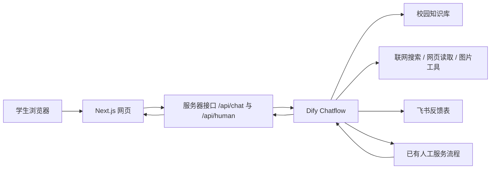

# 校园新生 AI 服务助手

面向江西师范高等专科学校新生的校园服务原型，把校园资料查询、照片展示、问题反馈与人工服务集中到同一个对话入口。

**[在线体验](https://jxsf-ai.netlify.app/chat)** · **Next.js / React / TypeScript / Dify / 飞书多维表格 / Netlify**

本仓库存放网站前端、服务器接口、校园图片及自动化测试。知识库检索、联网工具、意图分类和飞书写入由 Dify 工作流负责；本仓库目前不包含可导入的 Dify DSL，不能仅靠克隆仓库复现完整工作流。

## 项目解决的问题

新生的高频问题分散在通知、攻略和人工咨询中，来源与日期容易混淆。项目通过对话入口提供资料查询，并把无法直接解决的问题交给反馈表单或已有人工服务流程。回答应区分学校规定、第三方参考和未确认信息。

## 核心能力与实现位置

| 能力 | 当前实现 | 主要位置 |
| --- | --- | --- |
| 校园咨询 | 服务器调用 Dify，前端展示回答和知识库来源 | `app/api/chat/route.ts`、`lib/dify.ts` |
| 连续对话与历史 | 保存会话编号，通过签名访客身份读取对应会话 | `app/chat/page.tsx`、`app/api/history/route.ts`、`lib/server-session.ts` |
| 图片与资源链接 | Markdown 图片、表格和链接展示；不执行原始 HTML | `components/ChatMarkdown.tsx`、`public/images/campus-images/` |
| 学生反馈表单 | 展示学生表单，核对字段和操作后提交；写入飞书由 Dify 完成 | `components/HumanInputForm.tsx`、`app/api/human/route.ts` |
| 人工服务 | 展示学生人工请求，等待并读取工作人员回复 | `app/api/human/route.ts`、`lib/dify.ts` |
| 长任务续读 | 保留流程编号，继续读取同一流程的结果，避免重新发起原问题 | `components/RunProgress.tsx`、`lib/dify.ts` |

## 系统架构



- Dify 应用密钥仅在服务器使用；飞书密钥保存在 Dify 环境变量中。
- 服务器只向学生返回公开回答和可用的学生表单；工作人员表单转换为等待状态，审批令牌不返回浏览器。
- 长任务断连后读取原流程事件；表单已提交后不因读取失败重复提交。
- 签名访客身份用于区分浏览器会话，不等同于学校统一身份认证。

## 仓库结构

```text
app/
  chat/page.tsx          对话入口与消息展示
  history/page.tsx       历史会话页面
  api/chat/route.ts      Dify 对话请求
  api/human/route.ts     学生表单提交与流程续读
  api/history/route.ts   历史会话读取
components/
  ChatMarkdown.tsx       图片、表格和安全链接展示
  HumanInputForm.tsx     学生表单与人工等待状态
  RunProgress.tsx        耗时较长的流程结果读取
lib/
  dify.ts               事件流解析、表单分类与公开数据过滤
  server-session.ts     签名访客身份
public/images/          校园图片与站点视觉素材
tests/                  事件解析、表单权限、会话、历史和 Markdown 测试
netlify.toml            网站构建配置
```

## 验证与当前边界

2026 年 10 月 7 日运行 `node --test tests/*.cjs`，**19 项自动化测试通过**。测试使用模拟事件与请求，不能替代真实 Dify、飞书与人工服务联调。

同日的一轮线上验收共 24 项：18 项通过、2 项失败、3 项阻塞、1 项暂缓。已演示知识库回答、校园照片、反馈保存及人工回复；宿舍回答的归纳范围、课表入口核实和反馈去重仍需完善。此记录是当次验收快照，不表示所有功能均已完成。

- 个人课表与成绩等业务未接入学校系统；公开网页和知识库不能代替个人查询接口。
- 反馈记录需要维护者审核，不会自动成为知识库内容；飞书资源清单也不会自动同步到 Dify。
- 当前尚未实现完整的反馈幂等去重，网络异常时不应承诺记录一定只写入一次。
- “有帮助 / 没帮助”评价保存、更多表单字段类型和学校统一身份认证尚未接入。

下面保留本地运行、部署和联调说明，供继续开发时使用。

## 对应的 Dify 副本

- 应用：校园新生 AI 服务助手 副本
- 编辑地址：https://cloud.dify.ai/app/30de30b8-d6fd-42e7-944a-e69eda067d03/workflow
- Dify 负责知识库检索、联网查询、图片查询、意图分类、表单校验和飞书写入。
- 网页负责显示回答、展示学生表单、提交已选择的操作，以及读取后续结果。

编辑地址不是 API 地址。是否实际连接副本由服务器的 `DIFY_API_KEY` 决定；仅修改代码不会切换 Dify 应用。

## 本地运行

```bash
npm ci
cp .env.example .env.local
npm run dev
```

在 `.env.local` 填入副本“访问点 / API 访问”提供的 API 地址与应用密钥。不要提交真实密钥，不要把密钥发送到聊天或截图里。

## 在现有 Netlify 项目上线

保留项目 `jxsf-ai`，以及现有域名 https://jxsf-ai.netlify.app/ 。

1. 在 Netlify 的仓库配置中确认使用 `lcx1130/jxsz-ai-assistant` 的 `main`。
2. 构建命令：`npm run build`；发布目录：`.next`。仓库内的 `netlify.toml` 已设置这两项。
3. Netlify 自动使用当前 Next.js 适配器。不要将 `public/` 当作整个 Next.js 网站上传，也不要添加将 `/api/*` 转到 `index.html` 的通用静态重写。
4. 在 Netlify 环境变量中把 `DIFY_API_KEY` 换成**新副本的应用密钥**，并确认 `DIFY_API_BASE_URL` 与副本显示的 API 地址一致。密钥只供服务器使用，不能加 `NEXT_PUBLIC_` 前缀。
5. 环境变量需同时可用于构建和 Functions；改完必须重新构建部署。
6. 如果设置了独立的 `SESSION_SECRET`，保留它；否则会话签名使用 Dify 密钥。切换密钥后需要新建对话，旧应用的对话不能直接拿到新应用继续。
7. Dify 中的最新工作流也要发布。未发布的编辑改动不会出现在网站调用结果里。

飞书密钥仍留在 Dify 环境变量，不需要复制到网页代码或 Netlify。

## 上线验证

- 只查知识库中的四六级资源：返回已收录链接，不打开反馈表单。
- 请求联网查询宿舍条件：显示真实来源与资料日期。
- 查看食堂照片：显示图片；查询内部照片时不能用外观照片代替。
- 打开提交反馈：显示学生表单，允许取消；取消不应新增飞书记录。
- 提交一条注明“部署验证”的测试反馈：检查返回编号与飞书新增记录一致。
- 工作人员的回复表单和审批令牌不得出现在学生网页。

只有真实线上验证通过后，才能宣称新副本已上线且该功能可用。

## 表单支持和限制

- 支持原有 `service_issue` 人工咨询表单。
- 支持最多三个 paragraph 字段、包含 `SUBMIT_FEEDBACK` 或“提交反馈”操作的反馈表单。
- 支持 Dify 返回的 `actions` 和 `user_actions` 两种字段。
- 取消反馈允许空输入；正式提交的必填和业务内容由 Dify 现有校验分支判断。
- 服务端根据 Dify 实际表单定义核对字段和操作，不接收伪造的工作人员回复字段。
- 工作人员 Email 表单保持等待状态。表单提交成功后只读取后续结果，不因读取失败再次提交。
- 当前不支持 select、file 等字段；如果以后扩展 Dify 表单类型，需要同步更新前端。
- “有帮助 / 没帮助”目前仍是展示按钮，尚未接入评价保存。

## 耗时较长的查询

Netlify 的同步请求有 60 秒上限，本项目实测约 30 秒时还可能出现平台错误。因此每次读取事件流最多等待 15 秒，保留 Dify 的流程编号，随后通过 `/workflow/{id}/events` 自动读取同一次查询的后续结果；不会重复发送原问题，也不会重新提交反馈。

页面保持“正在查询”的状态，完成后显示回答；临时断连会继续获取结果。连续等待超过十分钟时可点击“继续等待”。后端密钥仍仅在服务器使用，读取流程时始终使用签名访客身份。

参考：[Netlify 执行限制](https://docs.netlify.com/build/functions/configuration/)；[Dify 流程事件](https://docs.dify.ai/en/api-reference/workflow-runs/stream-workflow-events)。

## 校园图片

图片位于 `public/images/campus-images/`。工具返回 Markdown 图片链接，网页显示为图片并可点开查看。

已提供两张食堂外观与三张寝室示例。拍摄日期未知，寝室楼栋和房型未确认，图片不能证明当前统一配置或实际入住分配。

## 验证命令

```bash
node --test tests/*.cjs
npm run build
```

测试覆盖表单权限、反馈取消与提交验证、Dify 事件解析、历史记录、会话身份、Markdown 图片与安全链接。模拟测试不替代真实 Dify / 飞书联调。

接口说明：https://docs.dify.ai/en/api-reference/guides/human-input-flow
